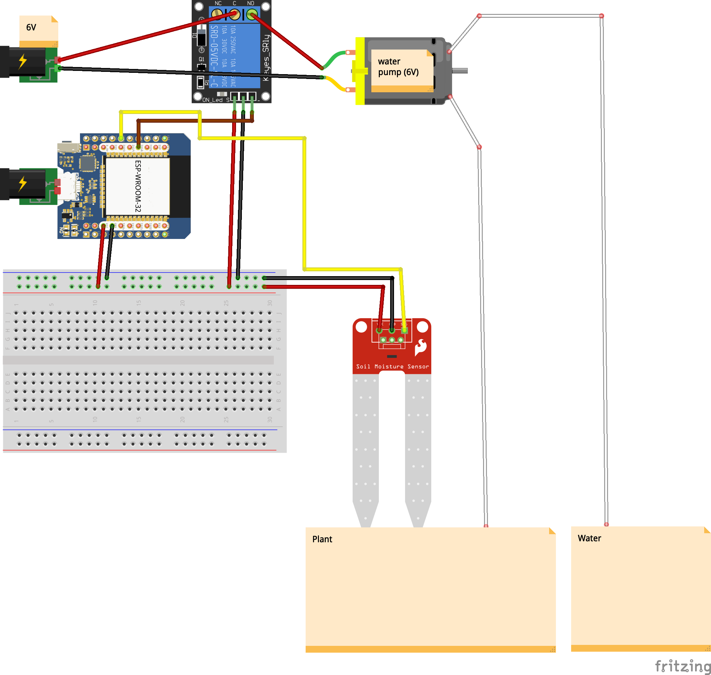
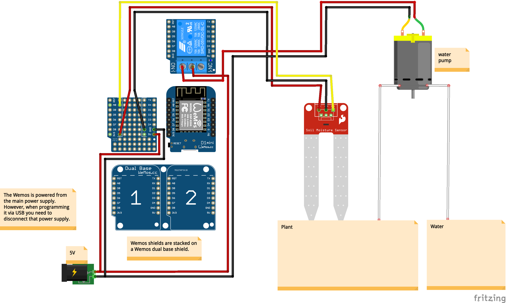
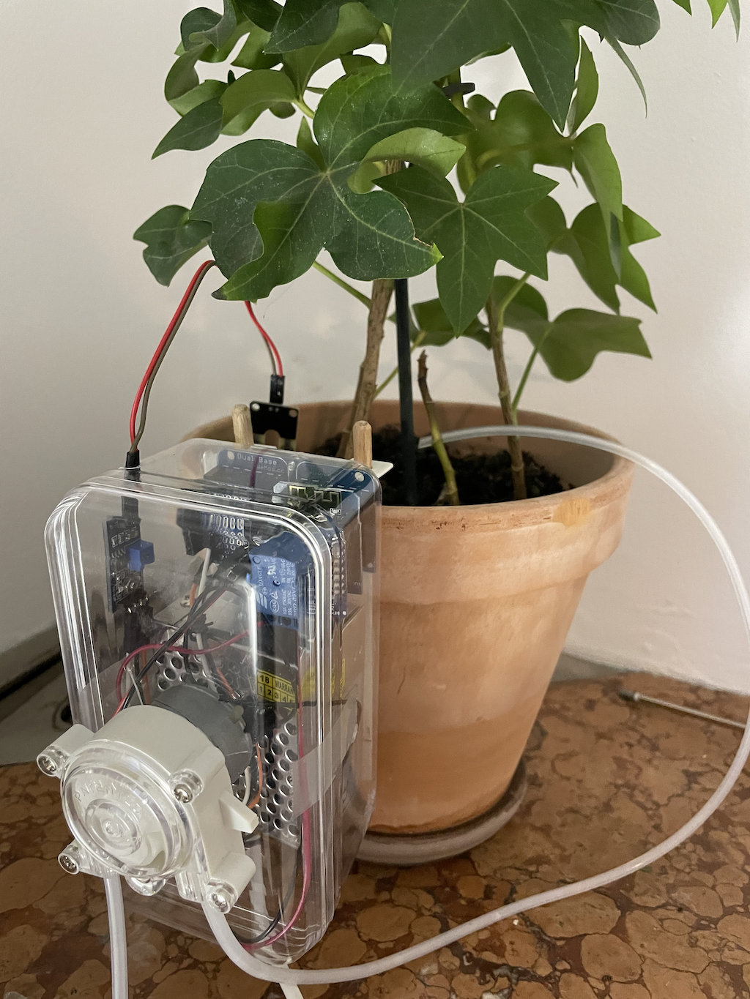

# plant-watering-system

## ESP32 WiFi



### Building

To build this project, first install [esp-idf from
github](https://github.com/espressif/esp-idf/) and follow the
instructions [getting started
guide](https://docs.espressif.com/projects/esp-idf/en/stable/esp32/get-started/)
to setup.

When done activate your esp-idf environment and configure the application.

```
$ idf.py menuconfig
````

It's especially important to enter your SSID and WIFI password in the
section: `Plant Watering Wifi Configuration`.

Once that is done you can build the application as usual:
```
$ idf.py build
```

Connect your esp32 and flash the application:
```
$ idf.py flash
```

If you want to troubleshoot you can always monitor the serial port using: 
```
$ idf.py monitor
```

## Using ESP8266



### Building

A very very basic example of a plant watering system. Just need to open the sketch in the Arduino IDE. 

Note: the current example code doesn't actually use the full potential of the ESP8266, i.e. does not use WiFi. Could have used another Arduino compatible board as well, but in this case it was chosen because of its compact size. 

## Pictures

The "plant watering backpack":


